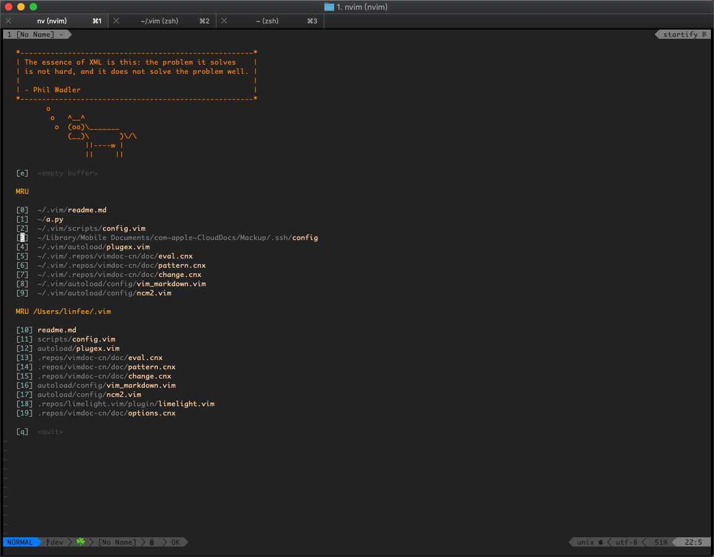

# A cool vim configuration

## Intro

This is a cool vim configuration, work on MacOS, Linux and Windows, thouth Windows
is not recommended.

It should work fine on both neovim(0.3+) and vim(8.0+), but I use neovim most
of my time, supervim on vim is not fully tested.

## Screenshots:

## Install(for most features)

### 0.Before you install supervim

Before you install supervim, remove these dir and files or backup them
- `~/.vimrc`
- `~/.vim`
- `~/.config/nvim/init.vim`

### 1.Install dependence

For linux(fedora):
- `sudo dnf install neovim git curl python3 ctags global fzf the_silver_searcher tmux`
- `pip3 install neovim jedi autopep8 yapf`

For osx:
- First of all, you need have brew
- `brew install neovim git curl python3 ctags global fzf the_silver_searcher tmux`
- `pip3 install neovim jedi autopep8 yapf`

### 2.clone this repo

- Clone `git clone https://github.com/Linfee/supervim.git ~/.vim`
- Optional, switch to dev branch `cd .vim && git fetch origin dev:dev && git checkout dev && cd ..`
- Let it work for neovim `mkdir -p ~/.config/nvim && echo 'source ~/.vim/vimrc' > ~/.config/nvim/init.vim`

### 3.launch nvim and install plugins

- `nvim`
- Execute in nvim `:PlugExInstall`, then wait until it's finished
  * If it's fail, just restart nvim and execute `:PlugExInstall` again

### 4.Install fonts

- `cp -r ~/.vim/res/fonts ~/supervim_fonts`
- Install fonts in `~/supervim_fonts` by yourself
  * For linux and osx, it's: `Sauce Code Pro Nerd Font Complete Mono.ttf` and `Sauce Code Pro Nerd Font Complete.ttf`
    - If you use item2 or other termianl software, make sure you set it's font to the font you installed just now
- `rm -rf ~/supervim_fonts`

